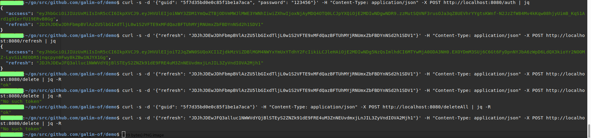

Endpoints:
- /auth - authenticate user with guid and password
- /refresh - returns new pair of accsess and refresh tokens
- /delete - delete certain refresh token
- /deleteAll - delete all refresh tokens  
